# Robot Models and Gazebo Simulation

This repository contains several robot-arm models described with **URDF** and **Xacro**:

- generic 6-DoF robot arm;
- PUMA robot arm;
- UR5e robot arm;
- custom 5-DoF arm mounted on a mecanum platform.

<p align="center">
  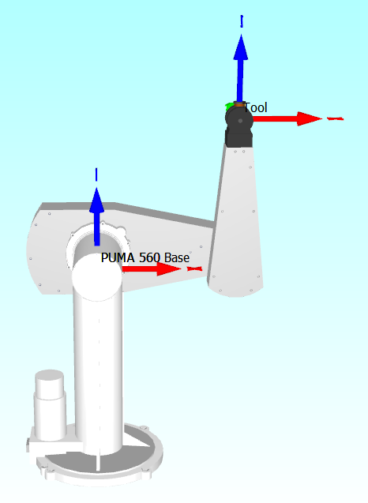
  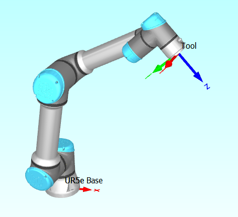
  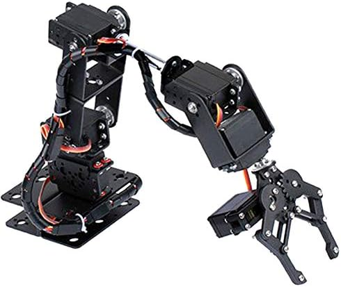
</p>

The robot description defines the links, joints, joint axes, limits, reference frames, visual and collision geometry, inertial properties and tool frame.

## Visualize a model in RViz2

RViz2 displays the robot model and its TF frames, but it does not simulate physics.

### Generic 6-DoF arm

```bash
ros2 launch my_arm_description display.launch.py \
  use_sim_time:=false \
  model:=my_arm.urdf.xacro
```
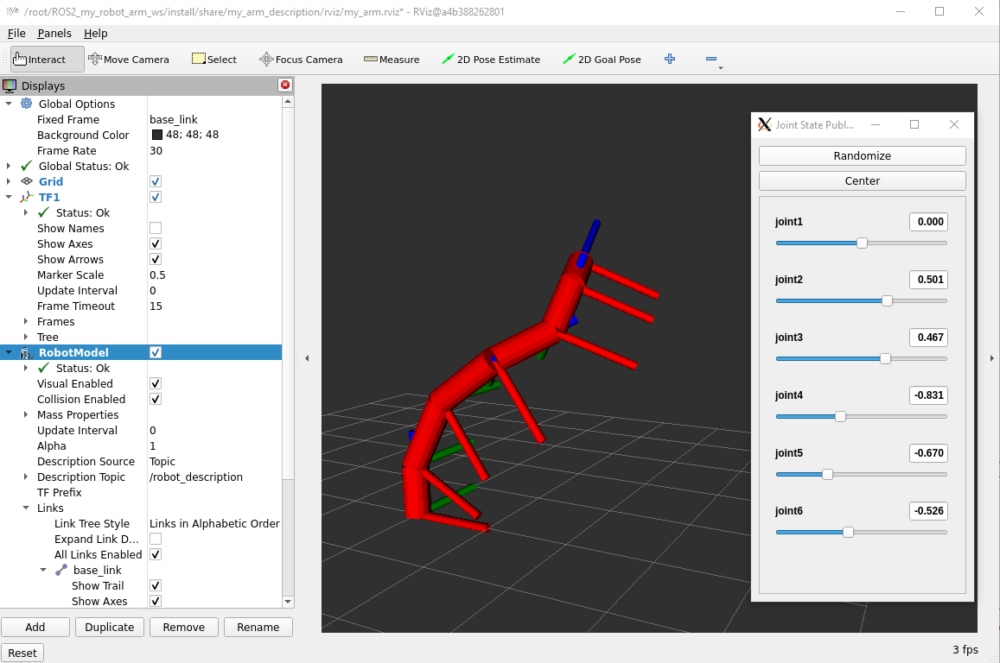

### PUMA arm

```bash
ros2 launch my_arm_description display.launch.py \
  use_sim_time:=false \
  model:=my_arm_puma.urdf.xacro
```
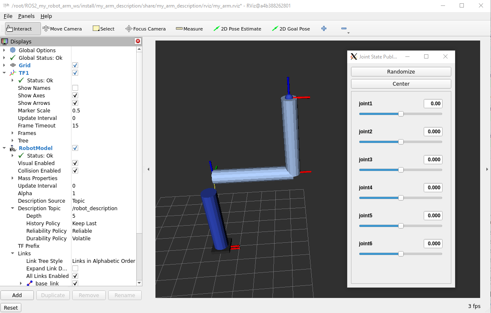

### UR5e arm

```bash
ros2 launch my_arm_description display.launch.py \
  use_sim_time:=false \
  model:=my_arm_ur5e.urdf.xacro
```


### Mecanum 5-DoF arm

```bash
ros2 launch my_arm_description display.launch.py \
  use_sim_time:=false \
  model:=my_arm_mecanum_5dof.urdf.xacro
```
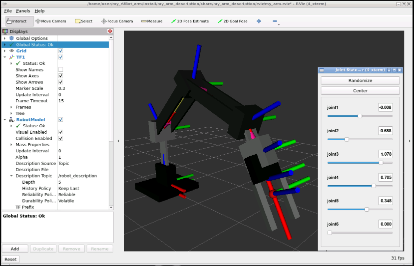

## RViz2 and Gazebo

RViz2 is mainly a visualization tool. Gazebo is a physics simulator and can simulate gravity, collisions, joint dynamics, actuators, sensors and ROS 2 controllers.

A model can be displayed in RViz2 without controllers. To move the robot in Gazebo, the model must include a `ros2_control` interface and suitable controllers.

## From robot description to robot control

The URDF/Xacro model describes the mechanical structure of the robot:

* links and joints;
* joint axes and limits;
* visual and collision geometry;
* inertial properties;
* reference frames and TCP.

However, the URDF description alone cannot move the robot.

To command the joints, ROS 2 uses the `ros2_control` framework.

## What is ros2_control?

`ros2_control` provides a standard interface between high-level ROS 2 controllers and the system that executes the robot joint commands.

The control architecture is divided into three main parts:

```text
Motion or planning node
          ↓
ROS 2 controller
          ↓
ros2_control hardware interface
          ↓
Gazebo simulated joints
```

This separation allows the motion nodes, controllers and simulated hardware to be developed and tested independently.

The `controller_manager` loads, configures and activates the ROS 2 controllers and connects them to the available command and state interfaces.

This architecture is described in:

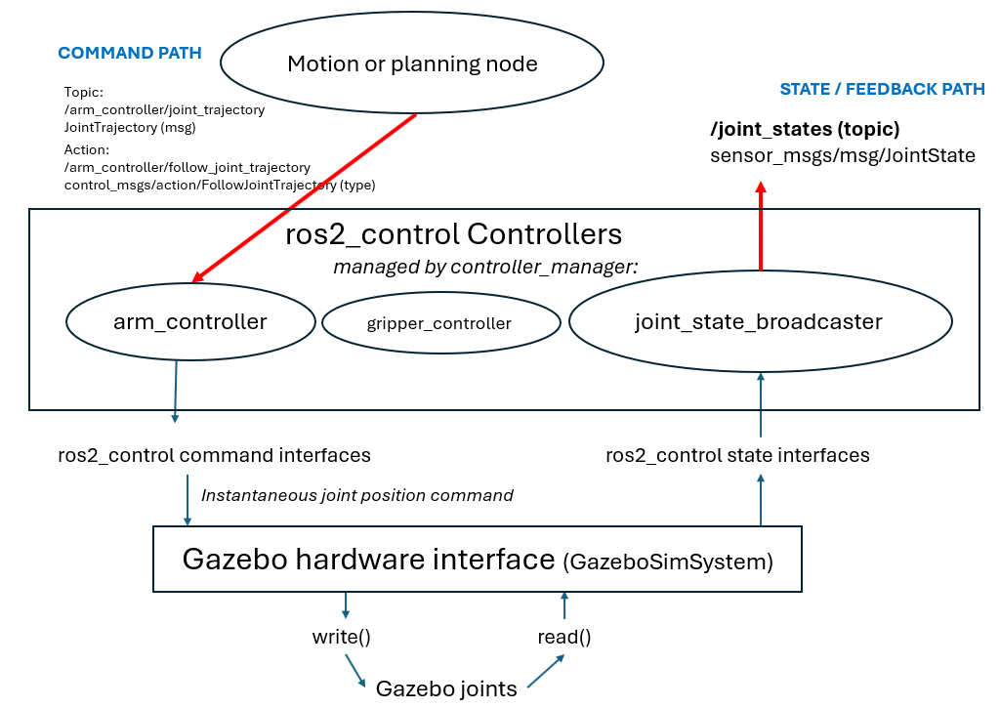

## ros2_control inside the URDF

The joints controlled by `ros2_control` are declared inside the robot Xacro file.

For the PUMA model, the relevant section is:

```xml
<ros2_control name="MyArmSystem" type="system">

  <hardware>
    <plugin>gz_ros2_control/GazeboSimSystem</plugin>
  </hardware>

  <joint name="joint1">
    <command_interface name="position"/>
    <state_interface name="position"/>
    <state_interface name="velocity"/>
  </joint>

  <!-- joint2 ... joint6 -->

</ros2_control>
```

The hardware plugin connects the ros2_control interfaces with the system that executes the joint commands.

In Gazebo, the plugin is:

```xml
<plugin>gz_ros2_control/GazeboSimSystem</plugin>
```

Therefore, the joint commands are sent to the simulated Gazebo joints.

Each joint declares its available interfaces:

* `command_interface`: values that a controller can command;
* `state_interface`: values that the hardware or simulation returns.

In this model, the controller commands joint positions and reads joint positions and velocities.

## Gazebo ros2_control plugin

The Xacro file also loads the Gazebo plugin:

```xml
<gazebo>
  <plugin
    name="gz_ros2_control::GazeboSimROS2ControlPlugin"
    filename="gz_ros2_control-system">

    <parameters>$(arg ros2_control_params)</parameters>

  </plugin>
</gazebo>
```

This plugin connects Gazebo with the ROS 2 `controller_manager`.

The `controller_manager` loads, configures and activates the ROS 2 controllers and connects them to the available hardware interfaces.

The `ros2_control_params` argument contains the path to the controller configuration file.

## Controller configuration

The controllers used in Gazebo are defined in:

```text
src/my_arm_gazebo/config/gz_controllers.yaml
```

The file defines two controllers:

```yaml
controller_manager:
  ros__parameters:

    joint_state_broadcaster:
      type: joint_state_broadcaster/JointStateBroadcaster

    arm_controller:
      type: joint_trajectory_controller/JointTrajectoryController
```

The `joint_state_broadcaster` reads the joint state interfaces and publishes:

```text
/joint_states
```

The `arm_controller` receives joint trajectories and commands the six arm joints:

```yaml
arm_controller:
  ros__parameters:

    joints:
      - joint1
      - joint2
      - joint3
      - joint4
      - joint5
      - joint6

    command_interfaces:
      - position

    state_interfaces:
      - position
      - velocity
```

The controller exposes two useful ROS interfaces:

```text
/arm_controller/joint_trajectory
/arm_controller/follow_joint_trajectory
```

The first is a topic interface. The second is a ROS 2 action interface that can report whether a trajectory was accepted and completed.


## Bring up the robot in Gazebo

Example with the PUMA model:

```bash
ros2 launch my_arm_gazebo my_arm_gazebo.launch.py \
  use_sim_time:=true \
  model:=my_arm_puma.urdf.xacro
```
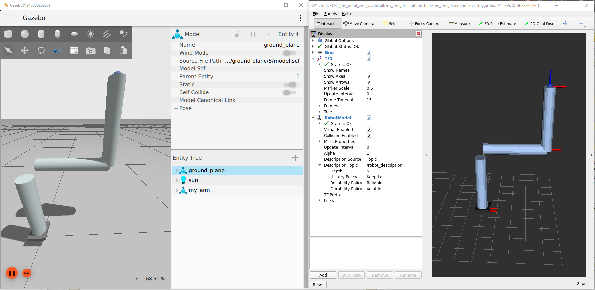

Example with the UR5e model:

```bash
ros2 launch my_arm_gazebo my_arm_gazebo.launch.py \
  use_sim_time:=true \
  model:=my_arm_ur5e.urdf.xacro
```
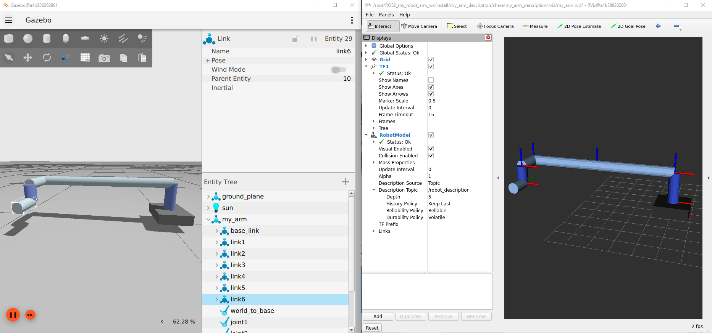

The bringup performs the following main steps:

1. starts Gazebo;
2. processes the selected Xacro model;
3. publishes `robot_description`;
4. spawns the robot in Gazebo;
5. starts the `controller_manager`;
6. loads the controller configuration;
7. activates the joint state broadcaster;
8. activates the arm trajectory controller.

Check the active controllers:

```bash
ros2 control list_controllers
```

Expected result:

```text
joint_state_broadcaster    active
arm_controller             active
```

Check the available hardware interfaces:

```bash
ros2 control list_hardware_interfaces
```

The position command interfaces should appear as available and claimed by the arm controller.

Check the current joint values:

```bash
ros2 topic echo /joint_states --once
```

## Test the ros2_control interface

A simple joint trajectory can be published to verify that the controller and the Gazebo hardware interface are correctly connected.

After verifying that `arm_controller` is active, publish one joint target:

```bash
ros2 topic pub --once \
  /arm_controller/joint_trajectory \
  trajectory_msgs/msg/JointTrajectory \
  "{
    joint_names: [
      'joint1',
      'joint2',
      'joint3',
      'joint4',
      'joint5',
      'joint6'
    ],
    points: [
      {
        positions: [0.0, -0.5, 0.8, 0.0, 0.3, 0.0],
        time_from_start: {sec: 3, nanosec: 0}
      }
    ]
  }"
```

The positions are expressed in radians.

This test sends the joint values directly:

```text
q = [q1, q2, q3, q4, q5, q6]
```

It does not calculate forward or inverse kinematics. Its only purpose is to verify the control chain:

```text
JointTrajectory
       ↓
arm_controller
       ↓
controller_manager
       ↓
GazeboSimSystem
       ↓
Gazebo joints
```

Check that the joint values change:

```bash
ros2 topic echo /joint_states
```

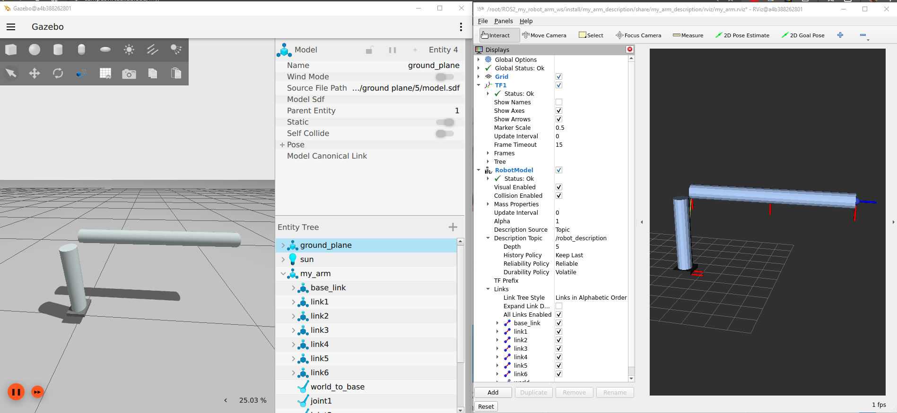
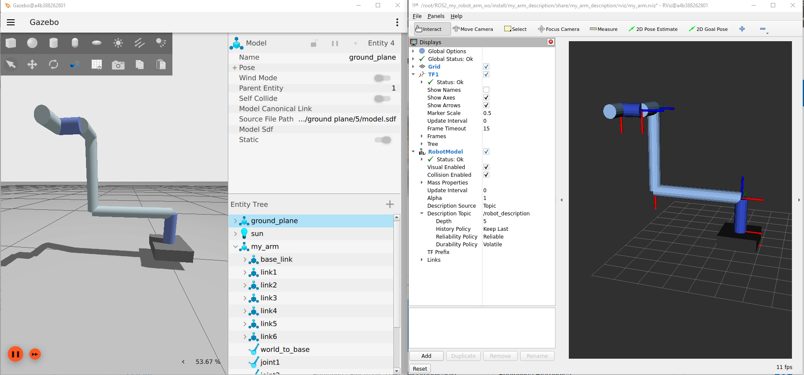

Forward and inverse kinematics are introduced in the next document.

