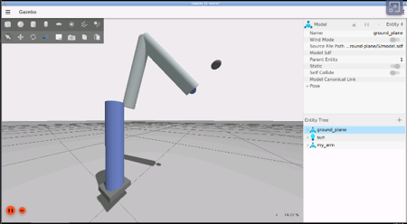
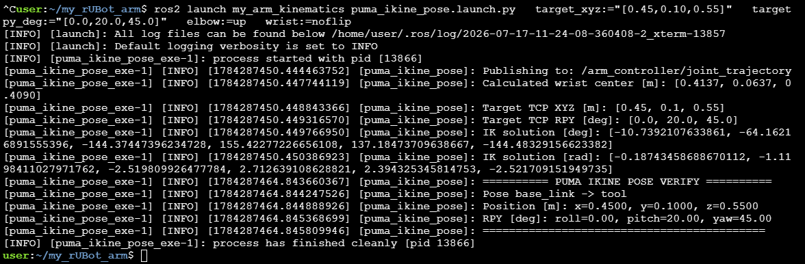

# Robot Arm Kinematics

Robot kinematics relates the joint coordinates of the arm to the position and orientation of its tool.

Two spaces are used:

- **joint space**: joint values `q1 ... q6`;
- **Cartesian space**: TCP position and orientation.

## my_arm_kinematics package

The analytical kinematics examples are implemented in the ROS 2 package:

```text
src/my_arm_kinematics
```

This package contains nodes and launch files for:

* PUMA forward kinematics;
* UR5e forward kinematics;
* PUMA inverse kinematics for a target position;
* PUMA inverse kinematics for a complete TCP pose.

The main launch files are:

```text
puma_fkine.launch.py
ur5e_fkine.launch.py
puma_ikine_position.launch.py
puma_ikine_pose.launch.py
```
These launch files start the following executables:

```text
puma_fkine_exe
ur5e_fkine_exe
puma_ikine_position_exe
puma_ikine_pose_exe
```

The forward-kinematics nodes calculate and display the TCP pose. They do not move the robot.

Running a forward-kinematics node does not change the joint configuration of the Gazebo robot. To compare the calculated pose with TF, the simulated robot must first be placed at the same joint configuration.

The inverse-kinematics pose node calculates a joint solution and sends it to the Gazebo trajectory controller.

## Start the simulation

The kinematics examples can be used in two different ways:

* forward kinematics can run as a standalone mathematical calculation;
* inverse kinematics can be executed and verified using the robot model in Gazebo.

For the complete workflow, start the robot in Gazebo with `ros2_control` and the trajectory controller.

### PUMA model

```bash
ros2 launch my_arm_gazebo my_arm_gazebo.launch.py \
  use_sim_time:=true \
  model:=my_arm_puma.urdf.xacro
```

### UR5e model

```bash
ros2 launch my_arm_gazebo my_arm_gazebo.launch.py \
  use_sim_time:=true \
  model:=my_arm_ur5e.urdf.xacro
```

These launches start the robot model, `robot_state_publisher`, the `controller_manager`, `joint_state_broadcaster` and `arm_controller`.

Check that the controllers are active:

```bash
ros2 control list_controllers
```

The forward-kinematics nodes do not require Gazebo because they only use the mathematical robot model.

If Gazebo is running, remember that executing a forward-kinematics node does not move the simulated robot. To compare the calculated TCP pose with TF, the robot must first be placed at the same joint configuration.

However, when Gazebo is running, the calculated TCP pose can be compared with the transform published by the simulated robot:

```bash
ros2 run tf2_ros tf2_echo base_link tool
```

## Forward kinematics

Forward kinematics computes the TCP pose from the joint values:

```text
q = [q1, q2, q3, q4, q5, q6]
                 ↓
              FK(q)
                 ↓
       TCP position and orientation
```

In this repository, the TCP pose is expressed relative to `base_link` as:

```text
x, y, z, roll, pitch, yaw
```

### PUMA forward kinematics

Run the PUMA example with the default joint values:

```bash
ros2 launch my_arm_kinematics puma_fkine.launch.py
```

Default joint configuration:

```text
[0.0, -40.0, 70.0, 0.0, 40.0, 0.0]
```

A different configuration can be provided:

```bash
ros2 launch my_arm_kinematics puma_fkine.launch.py \
  joints:="[0.0,-30.0,60.0,0.0,30.0,0.0]"
```

The joint values are expressed in degrees.

The node calculates and displays the TCP transformation, position and orientation.

### UR5e forward kinematics

Run the UR5e example:

```bash
ros2 launch my_arm_kinematics ur5e_fkine.launch.py
```

Default joint configuration:

```text
[0.0, -60.0, -135.0, -30.0, 90.0, 0.0]
```

A different configuration can be provided:

```bash
ros2 launch my_arm_kinematics ur5e_fkine.launch.py \
  joints:="[0.0,-90.0,90.0,-90.0,-90.0,0.0]"
```

The joint values are expressed in degrees.

These forward-kinematics examples do not require Gazebo. They only use the mathematical robot model.

## Forward and inverse kinematics

The two operations are complementary:

```text
Forward kinematics:
joint values q → TCP pose

Inverse kinematics:
TCP pose → joint values q
```

Forward kinematics produces one TCP pose for a given joint configuration.

Inverse kinematics may produce several joint configurations for the same TCP pose.

## Inverse kinematics

Inverse kinematics performs the opposite operation:

```text
Desired TCP pose
       ↓
Inverse kinematics
       ↓
Joint solution q
```

A robot may have several valid solutions, no solution, or a solution close to a singular configuration.

## Analytical IK of the PUMA arm

The PUMA robot has a spherical wrist. The axes of joints 4, 5 and 6 intersect at the wrist centre.

This allows the problem to be separated into two parts:

1. compute joints 1–3 from the wrist-centre position;
2. compute joints 4–6 from the desired orientation.

The implementation supports:

- `elbow:=up` or `elbow:=down`;
- `wrist:=noflip` or `wrist:=flip`.

## TCP and wrist centre

The desired pose is defined for the TCP frame `tool`, while the first three joints determine the position of the wrist centre, located at the intersection of the wrist axes near `link6`.

```text
p_wrist = p_tcp - R_tcp · p_tool_offset
```

For the current PUMA model:

```text
p_tool_offset = [0, 0, tool_z]
tool_z = 0.15 m
```

Therefore, the tool offset must be considered before solving joints 1–3.

## Run the analytical IK in Gazebo

Start the PUMA model in Gazebo as described in the previous section.

In another sourced terminal, send a TCP target:

```bash
ros2 launch my_arm_kinematics puma_ikine_pose.launch.py \
  target_xyz:="[0.45,0.10,0.55]" \
  target_rpy_deg:="[0.0,20.0,45.0]" \
  elbow:=up \
  wrist:=noflip
```



Main launch arguments:

| Argument | Meaning |
|---|---|
| `target_xyz` | TCP position `[x,y,z]` in metres |
| `target_rpy_deg` | TCP orientation `[roll,pitch,yaw]` in degrees |
| `elbow` | `up` or `down` |
| `wrist` | `noflip` or `flip` |
| `tool_z` | distance from `link6` to the TCP |
| `time_sec` | trajectory duration |
| `tcp_frame` | frame used for final verification |
| `use_sim_time` | use the Gazebo clock |

The node converts the TCP target into a wrist-centre target, computes the joint values, sends a trajectory to `/arm_controller/joint_trajectory` and verifies the final TCP pose.

## Verify the TCP pose

```bash
ros2 run tf2_ros tf2_echo base_link tool
```

For repeated targets, Gazebo can remain open. Only the IK launch must be executed again with a new target.
