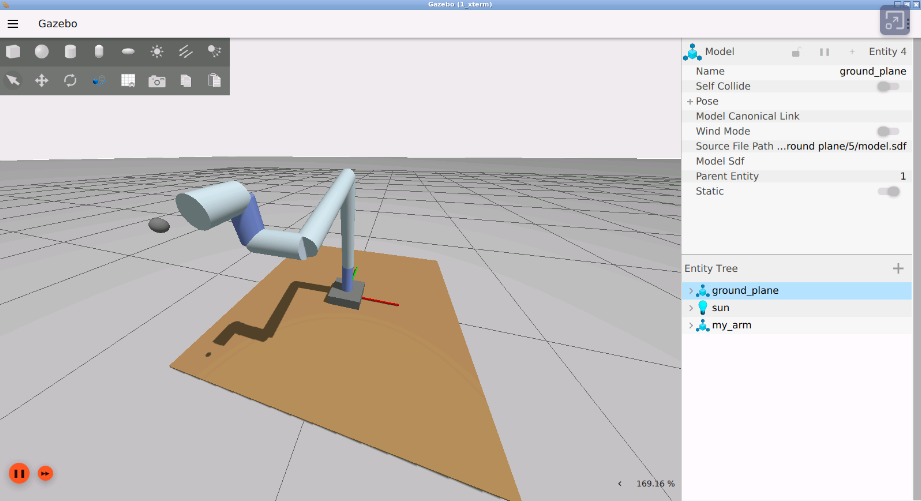
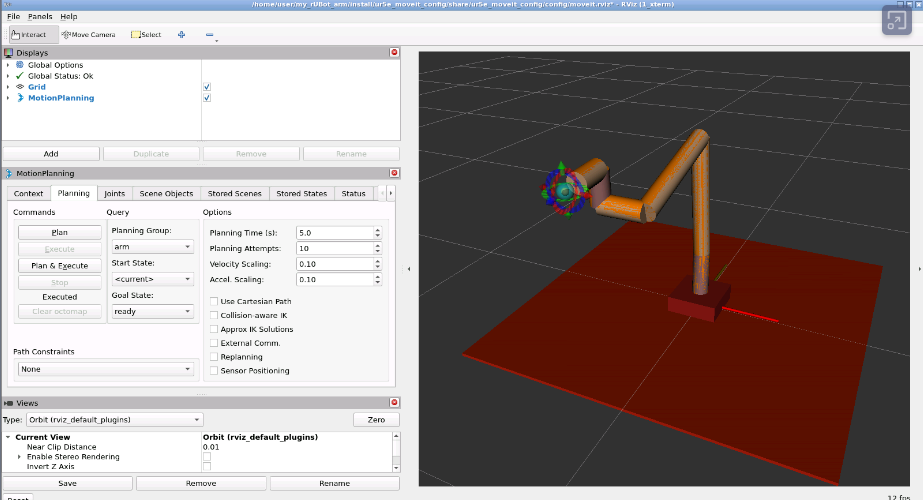
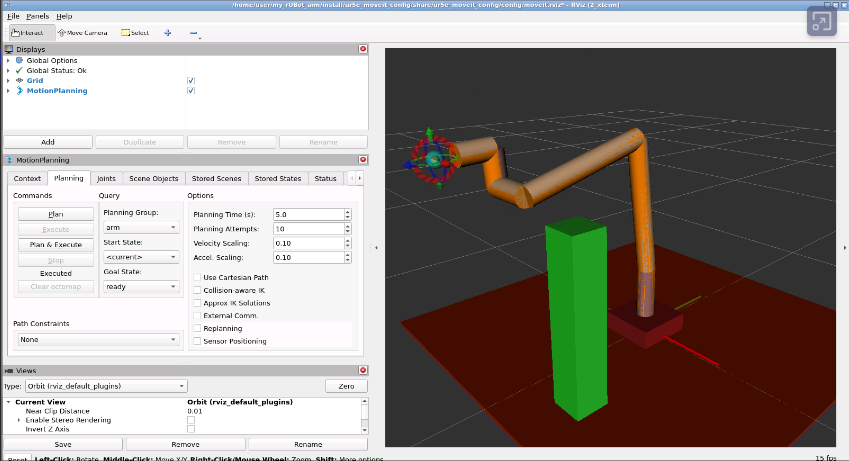

# MoveIt2 Motion Planning Validation

> Laboratory guide for **my_rUBot_arm**

------------------------------------------------------------------------

# 1. Why MoveIt if RoboDK already works?

Many students ask:

> **If RoboDK already executes MoveJ and MoveL, why do we need MoveIt?**

This laboratory answers that question experimentally.

## RoboDK

RoboDK is an excellent offline programming tool.

It can:

-   Compute Forward Kinematics (FK).
-   Compute Inverse Kinematics (IK).
-   Execute MoveJ and MoveL.
-   Simulate industrial robots.
-   Generate robot programs.

However, RoboDK normally assumes that the user defines a safe
trajectory.

It is not designed to continuously search among many possible robot
motions while considering a changing environment.

------------------------------------------------------------------------

## MoveIt

MoveIt is a motion planning framework.

It searches for many possible trajectories and selects the best one
according to several constraints.

``` text
Target Pose
      │
      ▼
Inverse Kinematics
      │
      ▼
Several IK candidates
      │
      ▼
OMPL planners
      │
      ▼
Many trajectories
      │
      ▼
Collision checking
      │
      ▼
Singularity analysis
      │
      ▼
Trajectory scoring
      │
      ▼
Best trajectory
      │
      ▼
Execute
```

------------------------------------------------------------------------

# 2. Learning objectives

After this laboratory the student should understand:

-   Difference between MoveJ and MoveL.
-   Difference between joint-space and Cartesian planning.
-   What a Planning Scene is.
-   Why singularities are dangerous.
-   Why MoveJ can avoid obstacles while MoveL cannot.
-   Why planning and execution should be separated.

------------------------------------------------------------------------

# 3. Laboratory setup

Launch:

-   Gazebo / Fake Hardware
````bash
ros2 launch my_arm_gazebo my_arm_gazebo.launch.py \
  use_sim_time:=true \
  model:=my_arm_ur5e.urdf.xacro \
  controllers:=gz_controllers.yaml \
  use_gripper:=false
````
-   MoveIt
````bash
ros2 launch ur5e_moveit_config move_group.launch.py \
  use_sim_time:=true
````
-   RViz
````bash
ros2 launch ur5e_moveit_config moveit_rviz.launch.py \
  use_sim_time:=true
````

Move the robot to **Ready**.




Do **not** use Home because the current Home pose is close to a wrist
singularity.

------------------------------------------------------------------------

# 4. Laboratory roadmap

``` text
Experiment 1
MoveJ planning

↓

Experiment 2
MoveJ + Singularity analysis

↓

Experiment 3
MoveL planning

↓

Experiment 4
MoveL + Singularity analysis

↓

Experiment 5
Planning Scene

↓

Experiment 6
MoveJ with obstacle

↓

Experiment 7
Save trajectory

↓

Experiment 8
Execute saved trajectory
```

------------------------------------------------------------------------

# 5. Experiment 1 --- MoveJ planning

## Goal

Understand the MoveIt planning pipeline without considering
singularities.

Run:

``` bash
ros2 launch my_arm_motion arm_movej_candidates.launch.py \
  use_sim_time:=true \
  target_xyz:="[300,-200,400]" \
  target_rpy:="[90,0,0]" \
  ik_candidates:=4 \
  plans_per_ik:=3 \
  seed_perturbation_deg:=45.0 \
  check_singularities:=false \
  avoid_collisions:=true \
  execute:=false
```
> Seed perturbation randomly modifies the current joint configuration before solving inverse kinematics. A larger perturbation explores more IK solutions but may also increase planning failures.

Observe:

-   IK candidates
-   OMPL plans
-   Selected trajectory
-   Saved YAML file

### Results

The planner was configured to search:

- 4 IK candidates
- 3 OMPL plans for each IK candidate
- A maximum of 12 trajectory candidates

In this execution, the first IK solution generated three valid OMPL
trajectories. The remaining planning attempts failed.

```text
Candidate 1: valid, path=12.069, score=98.760
Candidate 2: valid, path=11.142, score=98.853
Candidate 3: valid, path=11.161, score=98.851
Candidates 4-12: planning failed
```
MoveIt selected: IK solution 1, OMPL plan 2

Candidate 2 was selected because it had the shortest joint-space path
and the highest score.

The trajectory was stored in: `install/my_arm_motion/share/my_arm_motion/trajectories/movej_no_obstacle.yaml`

Discussion:

-   Why are there several valid trajectories?
-   Why does MoveIt select only one?

------------------------------------------------------------------------

# 6. Experiment 2 --- MoveJ with singularity analysis

Repeat the previous experiment using:

``` text
check_singularities:=true
min_singular_value:=0.01
max_condition_number:=200
```
> Node computes the singular values of J(q) in: x˙=J(q)q˙
> ​min_singular_value: Minimum acceptable singular value. Smaller values indicate that the robot is closer to a kinematic singularity.
> Node also computes κ(J)=σmin/​σmax​​
> max_condition_number: Maximum acceptable Jacobian condition number. Larger values indicate poorer kinematic conditioning and a higher risk of singularity.

Run 
```bash
ros2 launch my_arm_motion arm_movej_candidates.launch.py \
  use_sim_time:=true \
  target_xyz:="[300,-200,400]" \
  target_rpy:="[90,0,0]" \
  ik_candidates:=4 \
  plans_per_ik:=3 \
  seed_perturbation_deg:=45.0 \
  check_singularities:=true \
  min_singular_value:=0.001 \
  max_condition_number:=1000.0 \
  avoid_collisions:=true \
  execute:=false
```
Observe:

-   Rejected candidates
-   Accepted candidates
-   sigma_min
-   condition number

### Results

The planner evaluated up to 12 MoveJ trajectory candidates.

Several valid candidates were found, but their kinematic quality was very different.

For example:

```text
Candidate 2:
sigma_min = 0.005132
condition = 360.62
path = 7.170
score = -3.833

Candidate 5:
sigma_min = 0.157199
condition = 12.62
path = 3.785
score = 15.192
```
Candidate 5 was selected because it had:

- a larger minimum singular value;
- a much lower condition number;
- a shorter joint-space path;
- the highest final score.

This shows that two trajectories can reach the same target pose but have very different distances from kinematic singularities.

Discussion:

-   Why are some trajectories rejected?
-   How does singularity analysis improve safety?

------------------------------------------------------------------------

# 7. Experiment 3 --- MoveL planning

Run:

``` bash
ros2 launch my_arm_motion arm_movel_candidates.launch.py \
  use_sim_time:=true \
  target_xyz:="[300,-200,400]" \
  target_rpy:="[90,0,0]" \
  max_step:=0.005 \
  fraction_threshold:=1.0 \
  check_singularities:=false \
  avoid_collisions:=true \
  execute:=false
```
> max_step defines the maximum Cartesian distance between consecutive trajectory points
> fraction_threshold defines the minimum fraction of the Cartesian path that must be successfully generated.

Observe:

-   Straight TCP path
-   Cartesian interpolation
-   Planning fraction

Discussion:

-   Why are there fewer candidates than in MoveJ?

### Results and Discussion

Unlike MoveJ planning, MoveL planning requires the Tool Center Point (TCP) to follow a straight Cartesian line from the current pose to the target pose.

For each planning attempt, the node computes the Cartesian path and returns the completed path fraction.

Typical results are:

```text
Candidate 1: fraction = 0.789
Candidate 2: fraction = 1.000
Candidate 3: fraction = 0.789
```

A fraction of **1.0** means that the complete Cartesian path was successfully generated.

A fraction smaller than **1.0** means that only part of the requested straight-line motion could be planned.

When `fraction_threshold = 1.0`, only complete Cartesian trajectories are accepted.

An interesting observation is that executing the same command several times may produce different results. Sometimes no complete Cartesian path is found, while in other executions one of the planning attempts successfully reaches `fraction = 1.0`.

This behaviour is normal. The result depends on several factors, including:

- the current robot joint configuration,
- the inverse kinematics (IK) solution selected,
- numerical differences during the planning process,
- the planning attempt being evaluated.

The same target pose may therefore have several valid joint-space solutions, but not all of them allow the TCP to follow the required straight Cartesian line.

For this reason, if no complete MoveL trajectory is found on the first execution, it is often useful to run the planner again. A different IK solution may allow the complete Cartesian path to be generated.

This experiment also shows an important difference between MoveJ and MoveL planning:

- **MoveJ** only requires reaching the target pose and usually offers many alternative trajectories.
- **MoveL** requires the TCP to move along a straight Cartesian line, making the planning problem much more restrictive.

------------------------------------------------------------------------

# 8. Experiment 4 --- MoveL with singularity analysis

Run the same trajectory but enable singularity checking.

Try several target positions until a wrist singularity is detected.

Run:
```bash
ros2 launch my_arm_motion arm_movel_candidates.launch.py \
  use_sim_time:=true \
  target_xyz:="[300,-200,400]" \
  target_rpy:="[90,0,0]" \
  max_step:=0.005 \
  fraction_threshold:=1.0 \
  check_singularities:=true \
  min_singular_value:=0.001 \
  max_condition_number:=1000.0 \
  avoid_collisions:=true \
  execute:=false
```

Observe:

-   sigma_min
-   condition number
-   rejected Cartesian trajectories

### Results and Discussion

The MoveL planner found several complete Cartesian trajectories.

Three candidates completed the full path:

```text
Candidate 1:
fraction = 1.000
sigma_min = 0.003353
condition = 602.77

Candidate 2:
fraction = 1.000
sigma_min = 0.006041
condition = 334.54

Candidate 7:
fraction = 1.000
sigma_min = 0.005058
condition = 399.65
```
Candidate 2 was selected because it had the best kinematic conditioning among the complete trajectories:

- the highest minimum singular value;
- the lowest condition number;
- the highest final score.

This experiment shows that several MoveL trajectories may complete the same Cartesian path, but their distance from singular configurations can be different.

The singularity thresholds used in this experiment were:

- min_singular_value = 0.001
- max_condition_number = 1000

These relaxed limits allow the planner to compare several trajectories instead of rejecting them immediately.

------------------------------------------------------------------------

# 9. Experiment 5 --- Planning Scene

First fins best trajectory to target wothout obstacle

```bash
ros2 launch my_arm_motion arm_movej_candidates.launch.py \
  use_sim_time:=true \
  target_xyz:="[300,-200,400]" \
  target_rpy:="[90,0,0]" \
  ik_candidates:=6 \
  plans_per_ik:=4 \
  seed_perturbation_deg:=60.0 \
  check_singularities:=false \
  avoid_collisions:=true \
  execute:=false
```
> The trajectory selected is stored in Install folder with a default name. Copy it to `trajectroies` folder in repository if you want to keep it.


Add a collision object.
```bash
ros2 launch my_arm_motion arm_test_scene.launch.py \
  use_sim_time:=true \
  operation:=add \
  object_id:=moveit_test_box \
  box_xyz:="[150,-400,250]" \
  box_size:="[100,100,500]"
```
Remove the colision object if needed:
```bash
ros2 launch my_arm_motion arm_test_scene.launch.py \
  use_sim_time:=true \
  operation:=remove
```

Verify that the obstacle appears in RViz.



------------------------------------------------------------------------

# 10. Experiment 6 --- MoveJ with obstacle

Plan the same motion with the obstacle present.

Run:
```bash
ros2 launch my_arm_motion arm_movej_candidates.launch.py \
  use_sim_time:=true \
  target_xyz:="[300,-200,400]" \
  target_rpy:="[90,0,0]" \
  ik_candidates:=6 \
  plans_per_ik:=4 \
  seed_perturbation_deg:=60.0 \
  check_singularities:=false \
  avoid_collisions:=true \
  trajectory_file:="$(ros2 pkg prefix my_arm_motion)/share/my_arm_motion/trajectories/movej_with_obstacle.yaml" \
  execute:=false
```

Observe:

-   Collision-free trajectory
-   Selected candidate
-   Different joint-space path

Discussion:

Why can MoveJ avoid the obstacle?

------------------------------------------------------------------------

# 11. Experiment 7 --- Save trajectory

Verify the generated YAML trajectory.

Check:

-   metadata
-   joint names
-   trajectory points

> Insert YAML excerpt.

------------------------------------------------------------------------

# 12. Experiment 8 --- Execute saved trajectory

Run:

``` bash
ros2 launch my_arm_motion arm_execute_saved.launch.py \
  use_sim_time:=true \
  execute:=true
```

Observe:

-   No IK computation
-   No OMPL planning
-   Trajectory replay

Discussion:

Why is planning separated from execution?

------------------------------------------------------------------------

# 13. Questions

1.  Why can MoveJ generate many trajectories?
2.  Why is MoveL more restrictive?
3.  Why can't MoveL avoid a wrist singularity?
4.  What information is stored in the YAML file?
5.  Why is the Planning Scene important?
6.  Why are planning and execution separated?

------------------------------------------------------------------------

# 14. Main conclusions

MoveIt is not only a motion execution tool.

Its main strength is its ability to:

-   search,
-   evaluate,
-   compare,
-   reject,
-   select,

the best trajectory before execution.

These capabilities are essential for modern ROS 2 robotic applications.
