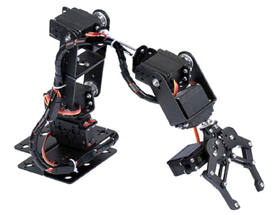
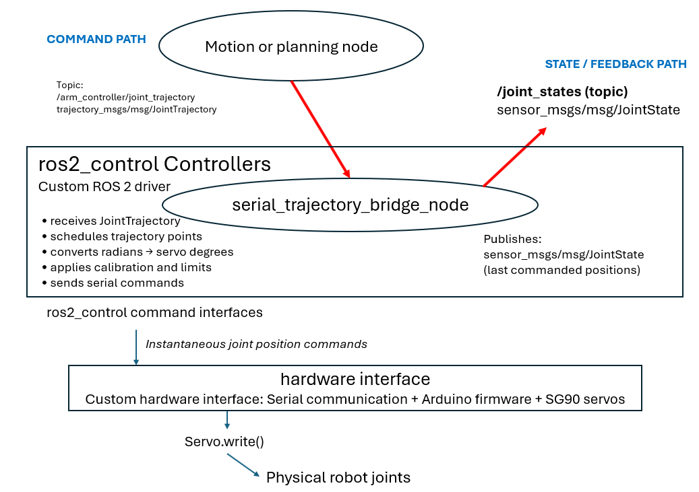

# ROS 2 Driver for the Mecanum Servo Arm

## Overview

This package provides a custom ROS 2 driver for the servo arm mounted on the rUBot mecanum platform.

The mechanism uses six SG90 servos controlled by an Arduino Nano ESP32:

- five servos control the arm joints;
- one servo controls the gripper.



The driver keeps a trajectory interface similar to the one used by the simulated arm:

```text
Topic:
/arm_controller/joint_trajectory

Message:
trajectory_msgs/msg/JointTrajectory
```

However, the real servo-arm driver does **not** use the `ros2_control` framework internally.

Instead, the essential controller and hardware-adaptation functions are implemented in:

```text
serial_trajectory_bridge_node
+
Arduino firmware
```

The complete command path is:

```text
Motion or planning node
          ↓
JointTrajectory message
          ↓
/arm_controller/joint_trajectory
          ↓
serial_trajectory_bridge_node
          ↓
USB serial communication
          ↓
Arduino Nano ESP32
          ↓
Servo.write()
          ↓
SG90 servos
          ↓
Physical arm joints and gripper
```

The driver also publishes:

```text
Topic:
/joint_states

Message:
sensor_msgs/msg/JointState
```

These joint states allow RViz and `robot_state_publisher` to display the expected arm configuration.

> **Important:** The SG90 servos do not return their physical position to ROS 2. Therefore, `/joint_states` contains the last commanded joint positions, not measured joint positions.

This architecture is described on:

---

## Relation with the ros2_control Architecture

In Gazebo, the arm uses the standard `ros2_control` architecture:

```text
JointTrajectory or FollowJointTrajectory
                    ↓
arm_controller
                    ↓
ros2_control command interfaces
                    ↓
GazeboSimSystem
                    ↓
Gazebo simulated joints
```

The simulated state path is:

```text
Gazebo simulated joints
                    ↓
GazeboSimSystem
                    ↓
ros2_control state interfaces
                    ↓
joint_state_broadcaster
                    ↓
/joint_states
```

The real mecanum servo arm uses a simplified custom implementation:

```text
JointTrajectory
        ↓
serial_trajectory_bridge_node
        ↓
joint position commands
        ↓
serial communication and Arduino firmware
        ↓
SG90 servos
        ↓
physical joints
```

The state path is:

```text
last commanded positions
        ↓
serial_trajectory_bridge_node
        ↓
/joint_states
```

The functional correspondence is:

| Gazebo ros2_control component | Mecanum servo-arm implementation |
|---|---|
| `arm_controller` | Trajectory reception and point scheduling inside `serial_trajectory_bridge_node` |
| `gripper_controller` | Gripper-servo command handled by the same bridge |
| `controller_manager` | Not used |
| `ros2_control` command interfaces | Joint positions processed internally by the bridge |
| `GazeboSimSystem::write()` | Joint conversion, serial transmission and Arduino firmware |
| Gazebo simulated joints | SG90 servos and physical joints |
| `GazeboSimSystem::read()` | Not available |
| `ros2_control` state interfaces | Last commanded positions stored by the bridge |
| `joint_state_broadcaster` | Joint-state publisher inside the bridge |
| `/joint_states` | Commanded positions, not measured positions |

This implementation follows the same basic control concepts as `ros2_control`, but it is a simplified custom ROS 2 driver rather than a complete `ros2_control` system.

---

## Driver Node

Node:

```text
serial_trajectory_bridge_node
```

### Subscription

Topic:

```text
/arm_controller/joint_trajectory
```

Message type:

```text
trajectory_msgs/msg/JointTrajectory
```

The message contains:

- the joint names;
- one or more trajectory points;
- the desired joint positions in radians;
- the execution time of each point in `time_from_start`.

### Publication

Topic:

```text
/joint_states
```

Message type:

```text
sensor_msgs/msg/JointState
```

The published message contains:

- the joint names;
- the last commanded joint positions;
- no measured velocity;
- no measured effort.

---

## Driver Operation

The driver performs the following operations:

1. Receives a `JointTrajectory` message.
2. Verifies that the trajectory contains valid points.
3. Reads the desired execution time of each point.
4. Waits until each trajectory point must be sent.
5. Converts ROS joint positions from radians to servo angles in degrees.
6. Applies servo-center calibration, direction signs and angle limits.
7. Sends the six servo angles through the serial port.
8. Stores the last commanded ROS joint positions.
9. Publishes the stored positions on `/joint_states`.

Example serial command:

```text
90,120,45,90,90,90
```

The values represent the six servo commands in degrees.

### Simplifications

The driver is intentionally simple.

It does not provide:

- a `FollowJointTrajectory` action server;
- trajectory cancellation;
- execution-result feedback;
- continuous trajectory interpolation;
- physical joint-position measurements;
- velocity or effort feedback;
- a `controller_manager`;
- a `ros2_control` hardware plugin.

The bridge sends the trajectory points according to their `time_from_start`. The low-level motion between two commanded positions is performed internally by each SG90 servo.

---

## Arduino Firmware

The Arduino firmware:

1. receives one line through the serial port;
2. separates the six comma-separated angles;
3. limits each angle to the interval `0–180°`;
4. calls `Servo.write()` for each servo.

Simplified command chain:

```text
Serial frame
      ↓
Arduino parser
      ↓
Servo.write(angle)
      ↓
PWM command
      ↓
SG90 internal position controller
      ↓
Servo shaft movement
```

Each SG90 includes an internal position-control loop based on an internal potentiometer. However, this internal position is not transmitted back to the Arduino or ROS 2.

---

## Joint-State Interpretation

The driver publishes:

```text
/joint_states
```

using the last commanded ROS joint positions.

Therefore:

```text
/joint_states position
=
expected joint position
```

and not:

```text
/joint_states position
=
measured physical joint position
```

If a future version used DC motors or smart servos with encoders, the state path could be:

```text
Physical joints
      ↓
Encoders
      ↓
Arduino
      ↓
Serial feedback
      ↓
ROS 2 driver
      ↓
/joint_states
```

In that case, `/joint_states` could contain measured joint positions and velocities.

---

## Launch Driver

```bash
ros2 launch my_arm_driver serial_trajectory_bridge.launch.py \
    serial_port:=/dev/ttyUSB0
```

Expected output:

```text
Serial trajectory bridge started on /dev/ttyUSB0 at 115200 baud
```

---

## Test 1: Verify Joint States

Launch the driver:

```bash
ros2 launch my_arm_driver serial_trajectory_bridge.launch.py
```

In another terminal:

```bash
ros2 topic echo /joint_states
```

Expected:

```yaml
name:
- arm_joint1
- arm_joint2
- arm_joint3
- arm_joint4
- arm_joint5
- arm_joint6

position:
- 0.0
- 0.0
- 0.0
- 0.0
- 0.0
- 0.0
```

These positions represent the last commanded joint positions.

---

## Test 2: Single Target

Launch the driver:

```bash
ros2 launch my_arm_driver serial_trajectory_bridge.launch.py
```

Send a target:

```bash
ros2 run my_arm_driver send_joint_target_node \
    --ros-args \
    -p target_joints_deg:="[0,0,0,0,0,0]"
```

Example:

```bash
ros2 run my_arm_driver send_joint_target_node \
    --ros-args \
    -p target_joints_deg:="[20,-30,40,0,0,0]"
```

Expected:

- the driver receives one trajectory point;
- the servos move to the target position;
- `/joint_states` is updated with the commanded target positions.

Driver output:

```text
Executing trajectory with 1 points
t=2.00s | Servo angles [deg]: [...]
Trajectory execution finished
```

---

## Test 3: Multi-Point Trajectory

Launch the driver:

```bash
ros2 launch my_arm_driver serial_trajectory_bridge.launch.py
```

Run:

```bash
ros2 run my_arm_driver send_joint_trajectory_node
```

Expected:

- several trajectory points are received;
- the trajectory points are sent at their configured execution times;
- the SG90 servos move between the commanded positions;
- `/joint_states` is updated with each commanded trajectory point.

Driver output:

```text
Executing trajectory with 5 points
t=1.00s ...
t=2.00s ...
t=3.00s ...
Trajectory execution finished
```

---

## Test 4: Verify JointTrajectory Topic

Open:

```bash
ros2 topic echo /arm_controller/joint_trajectory
```

Send a target:

```bash
ros2 run my_arm_driver send_joint_target_node
```

Expected:

```yaml
joint_names:
- arm_joint1
- arm_joint2
- arm_joint3
- arm_joint4
- arm_joint5
- arm_joint6

points:
- positions: [...]
```

---

## Test 5: Verify Joint-State Updates

Open:

```bash
ros2 topic echo /joint_states
```

Move the arm:

```bash
ros2 run my_arm_driver send_joint_trajectory_node
```

Expected:

```yaml
name:
- arm_joint1
- arm_joint2
- arm_joint3
- arm_joint4
- arm_joint5
- arm_joint6

position:
- ...
```

The published positions should change when each trajectory point is sent.

These values are the last commanded positions and are not physical measurements from the SG90 servos.
